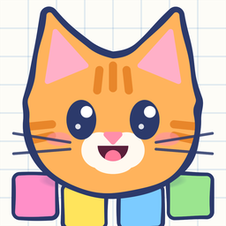
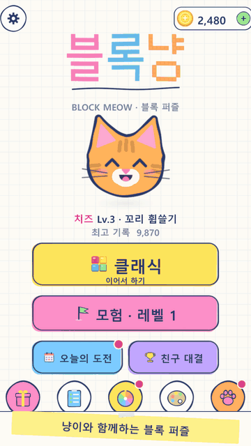
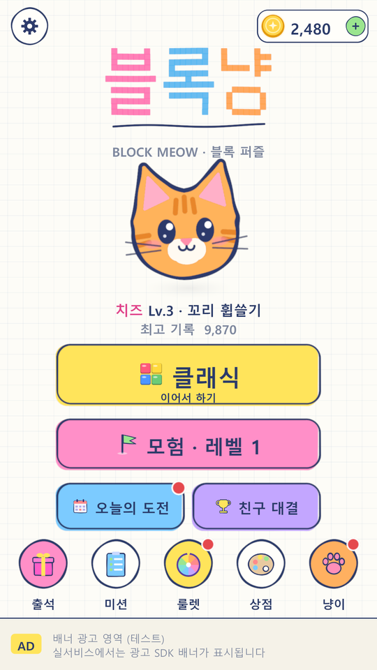
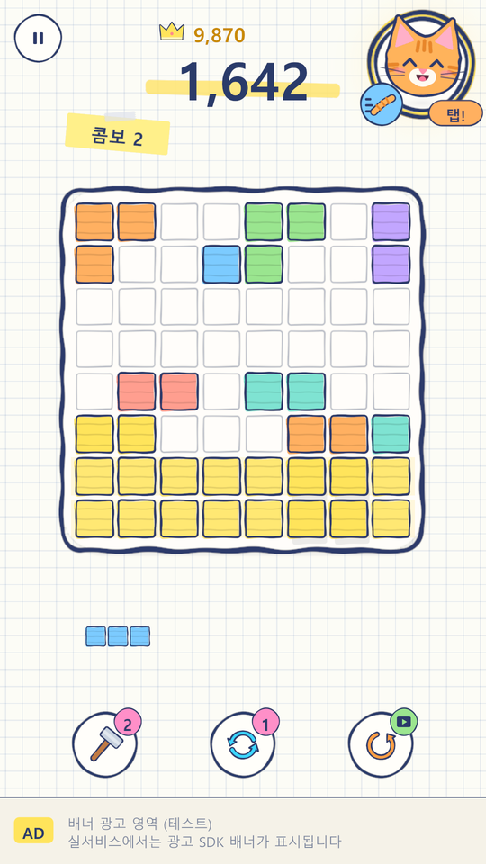
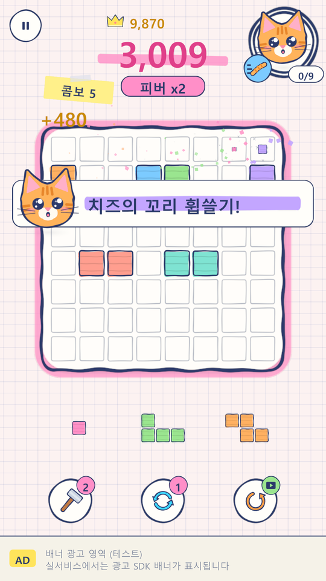
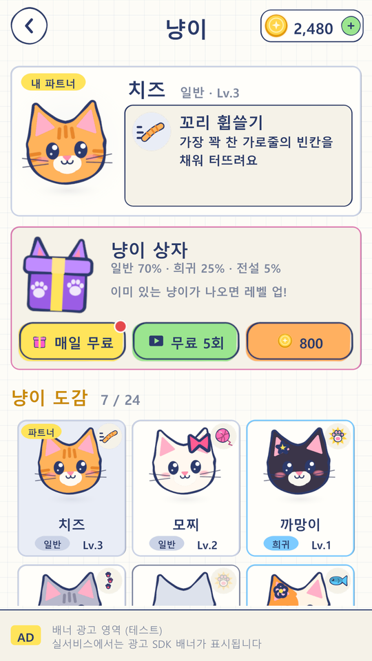
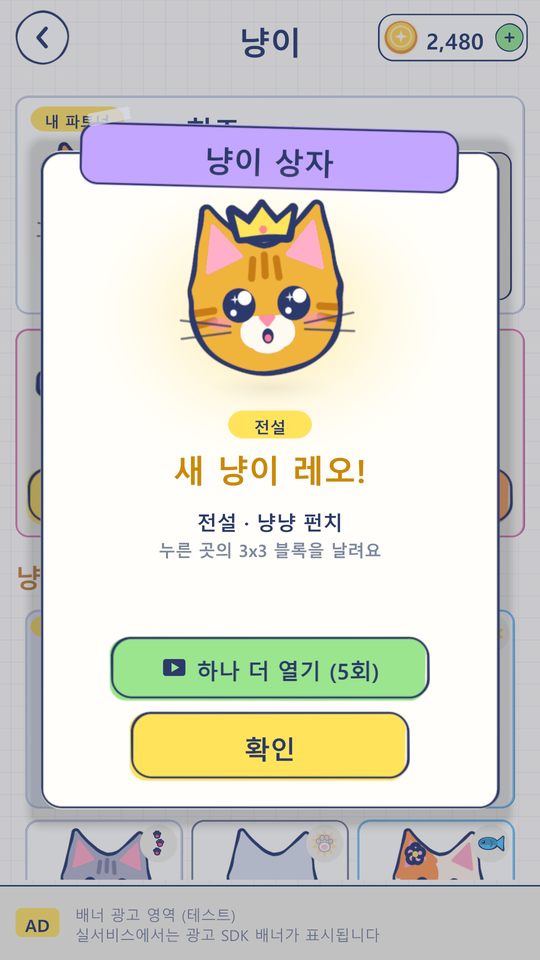
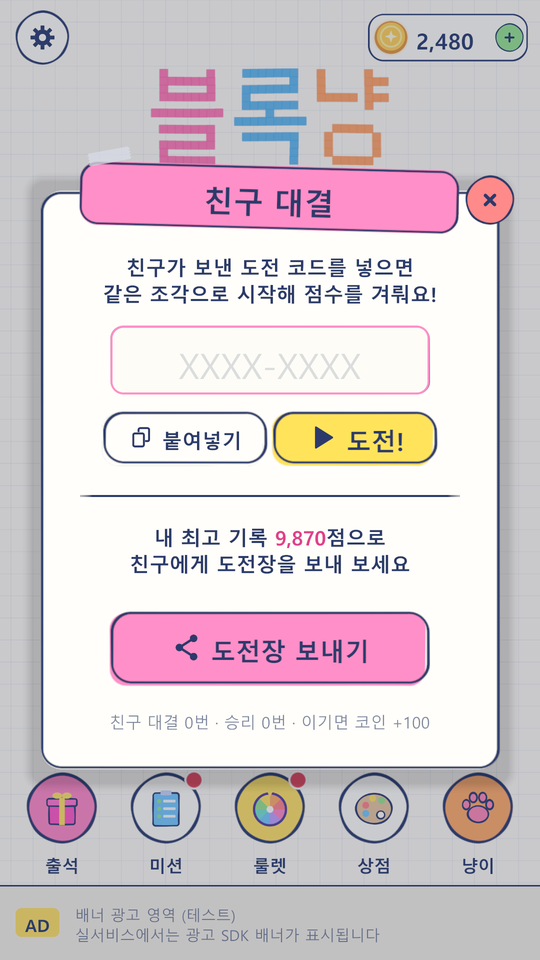
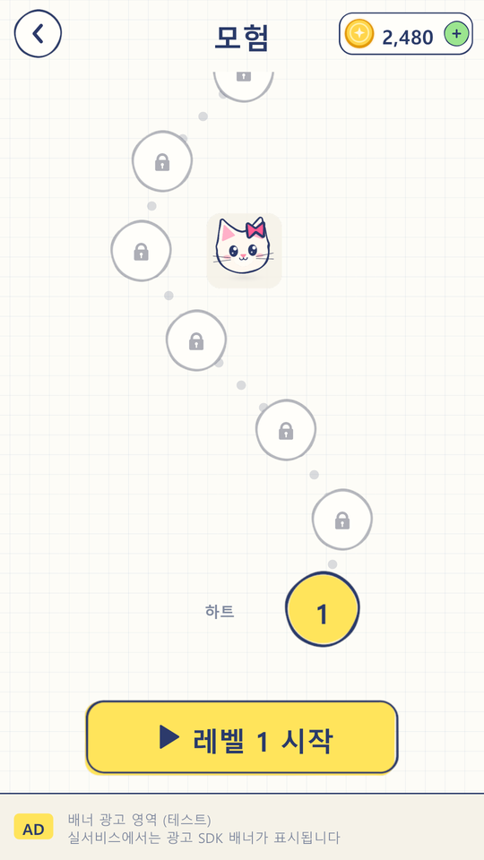

<p align="center"></p>

# 블록냥 (Block Meow)

광고 수익만으로 운영하는 캐주얼 블록 퍼즐입니다. 8x8 보드에 조각 3개를 끌어다 놓아 가로·세로 줄을 지우고, 파트너 고양이의 스킬로 위기를 넘깁니다. 인앱 결제는 없습니다.

기획서: https://claude.ai/code/artifact/b9d7f49e-e4f6-41b5-90c5-5e15c4cc8b0a

## 플레이 하이라이트

<p align="center">
  <a href="docs/media/highlight.mp4"></a>
</p>

줄 지우기 → 콤보·피버 → 냥이 스킬(슬로 모션) → 냥이 상자 → 친구 대결 순서로 24초 동안 보여 줍니다. GIF를 누르면 720x1280 MP4([`docs/media/highlight.mp4`](docs/media/highlight.mp4))로 볼 수 있습니다. 소리는 없습니다.

## 스크린샷

<table>
  <tr>
    <td align="center"><br>홈</td>
    <td align="center"><br>줄 완성 미리보기</td>
    <td align="center"><br>냥이 스킬 · 피버</td>
    <td align="center"><br>냥이 도감</td>
  </tr>
  <tr>
    <td align="center"><br>냥이 상자</td>
    <td align="center"><br>친구 대결</td>
    <td align="center"><br>모험</td>
    <td></td>
  </tr>
</table>

## 다른 블록 퍼즐과 다른 점

- **냥이 스킬**: 파트너 고양이를 데리고 판에 들어갑니다. 줄을 지우면 게이지가 차고, 고양이를 누르면 스킬이 터집니다. 스킬은 8종(냥냥 펀치, 꼬리 휩쓸기, 발톱 할퀴기, 꾹꾹이, 털뭉치 놀이, 생선 파티, 낮잠, 행운의 방울)이고, 레벨과 등급이 오르면 강화판으로 바뀝니다. 같은 판에서 쓸 때마다 다음 게이지가 2줄씩 길어져 무한히 버티지는 못합니다.
- **친구 대결 코드**: 서버 없이 `K7Q2-MZ4P` 같은 8자리 코드에 조각 시드와 점수를 담습니다. 결과 화면의 "도전장 보내기"로 메신저에 보내면, 받은 사람은 같은 첫 조각으로 시작해 그 점수를 넘기는 대결을 합니다.
- **고양이 수집·성장**: 24마리, 등급 3단계(일반·희귀·전설), 레벨 1~5. 냥이 상자에서 이미 있는 고양이가 나오면 레벨이 오릅니다. 상자는 매일 무료 1개, 광고로 하루 5개, 800코인으로 열 수 있습니다.
- **막힘 구조**: 놓을 곳이 없어도 스킬이나 부스터로 길을 낼 수 있으면 바로 끝내지 않고 "놓을 곳이 없어요" 메모를 띄웁니다. 플레이어가 "포기하기"를 누르거나 쓸 수단이 없을 때 게임 오버(이어하기 광고)로 넘어갑니다.

## 디자인: 모눈 노트

UI 시안 세 가지([`Design/UI_Concepts/v2`](Design/UI_Concepts/v2)) 가운데 **C · 모눈 노트**([`C_note.png`](Design/UI_Concepts/v2/C_note.png))를 골라 게임 전체에 적용했습니다.

- 배경은 연한 파란 모눈종이이고, 판은 연필로 칸을 그린 노트 한 장입니다.
- 블록·버튼은 형광펜으로 칠하고, 테두리는 손으로 그은 듯 살짝 흔들리는 남색 볼펜 선입니다. 칠은 선보다 조금 어긋나게 둡니다.
- 콤보·힌트·알림은 테이프로 붙인 포스트잇, 줄 완성 미리보기는 형광펜으로 줄을 긋는 모양입니다.
- 글자는 남색 잉크(`#2C3A6B`), 강조는 분홍·주황·초록 펜 색입니다. 앱 아이콘도 같은 스타일로 다시 그렸습니다.

이미지 파일 없이 모든 그림을 코드(SDF)로 그려 아틀라스 한 장에 담습니다. 노트 스타일 스프라이트는 `Scripts/Art/ArtNote.cs`, 색과 테마는 `Scripts/Core/Pal.cs`, 볼펜 테두리·포스트잇·형광펜 헬퍼는 `Scripts/UI/UIKit.cs`에 있습니다. 기본 블록 테마는 "노트"이고, 상점에서 젤리·네온 같은 다른 블록 테마를 열 수 있습니다.

## 실행

1. Unity 6000.6.2f1로 이 폴더를 엽니다.
2. `Assets/BlockMeow/Scenes/Main.unity`를 열고 Play를 누릅니다. Game 뷰는 세로 해상도(예: 1080x1920)로 두세요.
3. 씬·플레이어 설정(세로 고정, 패키지 이름)·앱 아이콘을 다시 만들려면 메뉴 `BlockMeow > Setup Project (Scene + Player Settings)`를 실행합니다.

처음 실행하면 튜토리얼 보드가 나오고, 첫 줄을 지우면 클래식 게임이 시작됩니다. 첫 스킬 게이지가 차면 손가락이 고양이를 가리킵니다. 진행 데이터는 `Application.persistentDataPath/blockmeow.json`에 저장되며, 설정 화면의 "진행 초기화"로 지울 수 있습니다.

## 스크린샷·하이라이트 다시 만들기

README의 이미지와 영상은 게임을 직접 돌려서 만듭니다. Play 모드에서:

1. `BlockMeow > Media > Capture Screenshots`: 주요 화면 7장을 `Temp/Media/shots`에 찍습니다.
2. `BlockMeow > Media > Record Highlight`: 정해 둔 판(콤보가 나는 보드)으로 드래그·스킬·냥이 상자·친구 대결을 자동으로 진행하며 30fps 프레임을 `Temp/Media/raw`에 저장합니다. 자막 포스트잇과 손가락, 엔딩 카드도 게임 UI로 그립니다.
3. `python Tools/media/make_media.py`(Pillow 필요): 속도 조절, 스킬 슬로 모션·줌, 화면 전환 페이드를 넣어 `Temp/Media/edited`에 편집본을 만들고, `docs/media/highlight.gif`와 `docs/images/*.png`를 씁니다.
4. `BlockMeow > Media > Encode Highlight Video`: 편집본을 H.264 MP4(`docs/media/highlight.mp4`)로 인코딩합니다.

녹화 중에는 애니메이션이 녹화 속도에 맞춰 1/30초씩 진행되고(`Time.captureDeltaTime`, `Clock.Dt`), 끝나면 저장 파일을 녹화 전 상태로 되돌립니다.

## Android 빌드

메뉴 `BlockMeow > Build Android APK`를 누르면 테스트용 APK가 `Build/Android/BlockMeow.apk`로 만들어집니다(IL2CPP, ARM64, 디버그 서명). 패키지 이름은 `com.blockmeow.puzzle`, 세로 고정입니다. 명령줄로도 빌드할 수 있습니다.

```
Unity -batchmode -projectPath . -buildTarget Android -executeMethod BlockMeow.EditorTools.BlockMeowSetup.BuildAndroid
```

스토어 출시용은 `File > Build Profiles`에서 키스토어를 지정하고 AAB(App Bundle)로 빌드합니다. Android에서는 "도전장 보내기"가 시스템 공유 창을 열고, 에디터와 PC에서는 클립보드에 복사합니다.

## 구조

| 폴더 | 내용 |
| --- | --- |
| `Scripts/Core` | 부트스트랩(`GameApp`), 저장·경제·고양이 상자(`Profile`), 광고 규칙(`Ads`), 도전 코드·공유(`Challenge`), 색·테마(`Pal`), 트윈, 애니메이션 시간(`Clock`) |
| `Scripts/Game` | 보드 모델, 조각 37종, 조각 생성기, 고양이·스킬 정의(`Cats`), 모험·도전 레벨 생성, 게임 진행(`GameSession`, 스킬은 `GameSession.Skills`), 렌더링, 이펙트 |
| `Scripts/Art` | SDF로 모든 스프라이트를 그려 아틀라스 1장에 담는 생성기, 노트 스타일(`ArtNote`), 고양이 레이어, 스킬 아이콘(`ArtSkills`), 앱 아이콘 |
| `Scripts/Audio` | 효과음 25종과 배경음악 3곡을 코드로 합성하는 신스, 재생 관리 |
| `Scripts/UI` | 코드로 만드는 uGUI: 홈, 게임 HUD(스킬 게이지), 모험 지도, 냥이 화면, 상점, 팝업(고양이 상세·상자·친구 대결은 `CatPopups`) |
| `Editor` | 씬·플레이어 설정·앱 아이콘 자동 생성, Android 빌드(`BlockMeowSetup`), 스크린샷·하이라이트 녹화와 MP4 인코딩(`MediaCapture`) |
| `Tools/media` | 녹화한 프레임을 편집해 README용 GIF·이미지를 만드는 스크립트 |
| `docs` | README에 쓰는 스크린샷(`images`)과 하이라이트 영상(`media`) |
| `Design/UI_Concepts/v2` | 손으로 만든 UI 시안 3종(HTML 목업과 렌더링 이미지) |

외부 이미지·사운드 에셋이 없습니다. 첫 실행 때 아트를 생성하고(에디터 약 3초), 빌드에서는 생성한 아틀라스를 디스크에 캐시합니다.

## 광고 SDK 연동

모든 광고 규칙은 `Scripts/Core/Ads.cs`에 있고, 실제 광고 표시는 `Ads.IAdProvider` 하나로 분리돼 있습니다. 지금은 `UIRoot`가 테스트용 화면으로 이 인터페이스를 구현합니다. LevelPlay, AppLovin MAX, AdMob 중 하나의 어댑터를 만들어 `GameApp`에서 `Ads.Provider`에 넣으면 됩니다.

- 배너: 화면 아래 150 단위를 비워 두었습니다(`UIRoot.BannerH`).
- 전면: 처음 3판 이후, 최소 90초 간격, 보상형 시청 후 45초는 건너뜁니다(`Ads` 상수).
- 보상형 9곳: 이어하기, 코인 2배, 부스터, 룰렛, 테마 해금, 무료 코인, 스킬 즉시 발동(판당 1회), 냥이 상자(하루 5회), 고양이 1판 체험(하루 3회). 일일 상한은 `Ads.DailyCap`.

## 밸런스 조정 지점

- 조각 난이도와 "줄을 완성할 수 있는 조각" 확률: `GameSession.Deal()`, `PieceGenerator`
- 스킬 게이지: `CatSkills.GaugeNeed()`(등급별 기본 8·7·6줄, Lv3·Lv5에 1줄씩 감소), `CatSkills.SkillCost`(스킬별 가감), `CatSkills.TiredStep`(사용할 때마다 +2줄)
- 스킬 강화 시점: `CatSkills.IsStrong()`(일반 Lv4, 희귀 Lv3, 전설 Lv2부터)
- 냥이 상자: `Profile.CatBoxOdds`(70/25/5%), `Profile.CatBoxCoins`, `Profile.GuaranteedNewBoxes`(처음 3상자는 새 고양이)
- 스킬 광고 횟수: `GameSession.SkillAdsPerGame`
- 모험·도전 난이도: `Levels.Adventure()`, `Levels.Daily()`
- 점수·콤보·피버: `GameSession.OnLinesCleared()`
- 코인 보상·가격·출석·미션: `Profile`, `Themes`
- 자동 플레이 봇: `GameSession.DebugAutoMove()`, `DebugAutoPlay()`. 스킬별 균형 측정은 플레이 중 `GameSession.I.DebugBalance(게임 수)`를 실행하면 결과가 콘솔에 나옵니다.

## 출시 전 할 일

- 테스트 광고를 실제 광고 SDK로 교체하고 개인정보 동의(UMP/ATT)를 붙입니다.
- 도전장 메시지에 들어가는 스토어 주소(`ChallengeCode.StoreUrl`)를 실제 출시 주소로 확인하고, 앱 링크(딥링크)로 코드가 자동 입력되게 하면 수락률이 오릅니다.
- 한글 글꼴은 지금 기기 OS 글꼴을 씁니다. 출시 빌드에는 Pretendard나 Noto Sans KR 같은 OFL 글꼴을 넣는 것을 권장합니다. 손글씨 느낌을 더하려면 나눔손글씨 같은 OFL 글꼴을 제목에만 써 볼 만합니다.
- 날짜 기반 기능(출석, 미션, 도전, 무료 상자)은 기기 시계를 씁니다. 서버 시간 검증과 로컬 알림은 아직 없습니다.
